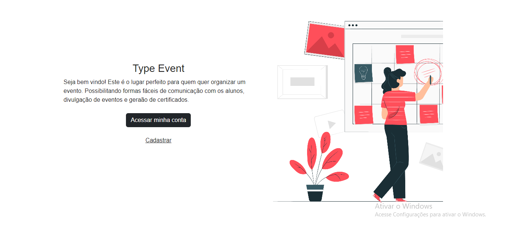
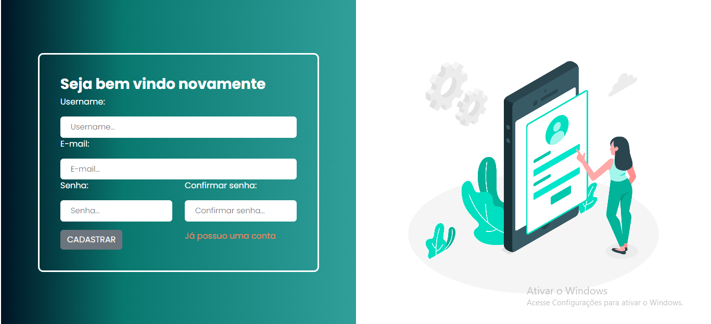
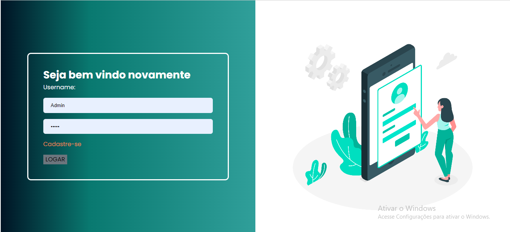
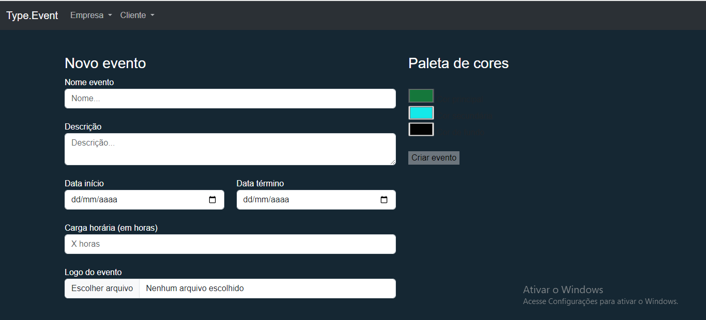
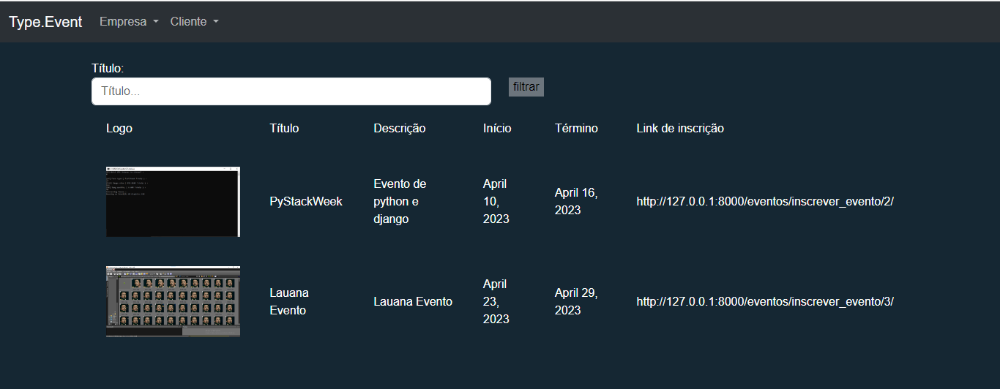
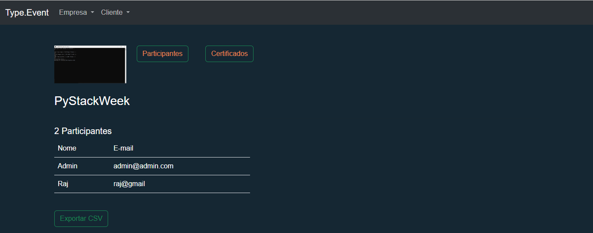

<!-- ============== HEADER ============== -->

  
  <h3>Gerenciador de Eventos</h3>

<!-- ============== ABOUT ============== -->
## About the project

  Projeto de gerenciamento de evetoscom funcionalidades responsáveis pelo cadastro de eventos, inscrição, login, cadastro de usuários, visualização de seus próprios eventos, geração de certificados.

<!-- ============== LANGUAGE ============== -->
## Telas

## landing page

## Cadastro 

## Login

## Cadastro de Eventos

## Visualização dos próprios eventos 

## Sobre o evento

## Certificados

<!-- ============== LICENSE ============== -->
## License

Distributed under the MIT License. See `LICENSE` for more information.

<!-- ============== AUTHOR ============== -->
## Author

[ @PatriciaDaros](https://github.com/PatriciaDaros)

(<a href="#header">back to top</a>)

